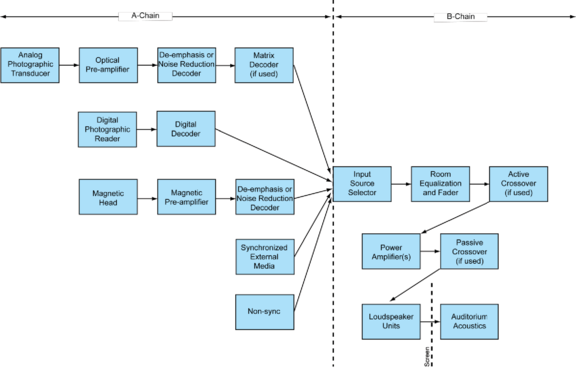
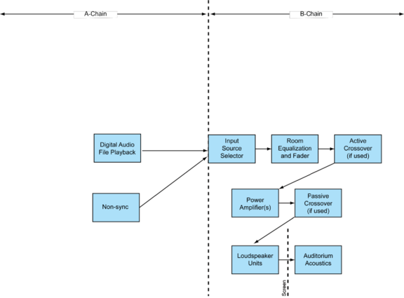

# ISO 2969:2015

## Title

Cinematography — B-chain electro-acoustic reponse of motion-picture control rooms and indoor theatres — Specifications and measurements

## Abstract

ISO 2969:2015 specifies the measurement methods and characteristic electroacoustic frequency response of the B-chain of motion-picture dubbing theatres (mixing rooms), screening rooms, and indoor theatres whose room volume exceeds 125 m3 (4,414 ft3). It is intended to assist in standardization of monitoring and reproduction of motion-picture sound in such rooms. The goal is to have constant perceived loudness and frequency response from installation to installation, and from position-to-position within an installation. This International Standard does not cover that part of the motion-picture sound system extending from the transducer to the input source audio selector.

## URL

[iso.org/standard/43646.html](https://www.iso.org/standard/43646.html)

## Sample

### Foreword

ISO (the International Organization for Standardization) is a worldwide federation of national standards bodies (ISO member bodies). The work of preparing International Standards is normally carried out through ISO technical committees. Each member body interested in a subject for which a technical committee has been established has the right to be represented on that committee. International organizations, governmental and non-governmental, in liaison with ISO, also take part in the work. ISO collaborates closely with the International Electrotechnical Commission (IEC) on all matters of electrotechnical standardization.
The procedures used to develop this document and those intended for its further maintenance are described in the ISO/IEC Directives, Part 1. In particular the different approval criteria needed for the different types of ISO documents should be noted. This document was drafted in accordance with the editorial rules of the ISO/IEC Directives, Part 2 (see www.iso.org/directives).
Attention is drawn to the possibility that some of the elements of this document may be the subject of patent rights. ISO shall not be held responsible for identifying any or all such patent rights. Details of any patent rights identified during the development of the document will be in the Introduction and/or on the ISO list of patent declarations received (see www.iso.org/patents).
Any trade name used in this document is information given for the convenience of users and does not constitute an endorsement.
For an explanation on the meaning of ISO specific terms and expressions related to conformity assessment, as well as information about ISO's adherence to the WTO principles in the Technical Barriers to Trade (TBT), see the following URL: Foreword — Supplementary information.
The committee responsible for this document is ISO/TC 36, Cinematography.
This third edition cancels and replaces the second edition (ISO 2969:1987), which has been technically revised.

### Introduction

This International Standard is to be used in conjunction with the relevant standards which cover that part of the motion picture sound system from the transducer to the input terminals of the main fader.
In this International Standard, normative text is text that describes elements of the design that are indispensable or contains the conformance language keywords: “shall”, “should”, or “may”. Informative text is text that is potentially helpful to the user, but not indispensable, and can be removed, changed, or added editorially without affecting interoperability. Informative text does not contain any conformance keywords.
All text in this document is, by default, normative, except: the Introduction, any section explicitly labelled as “Informative” or individual paragraphs that start with “Note”.
The keywords “shall” and “shall not” indicate requirements strictly to be followed in order to conform to the document and from which no deviation is permitted.
The keywords, “should” and “should not” indicate that, among several possibilities, one is recommended as particularly suitable, without mentioning or excluding others; or that a certain course of action is preferred but not necessarily required; or that (in the negative form) a certain possibility or course of action is deprecated but not prohibited.
The keywords “may” and “need not” indicate courses of action permissible within the limits of the document.
The keyword “reserved” indicates a provision that is not defined at this time, shall not be used, and may be defined in the future. The keyword “forbidden” indicates “reserved” and in addition indicates that the provision will never be defined in the future.
A conformant implementation according to this document is one that includes all mandatory provisions (“shall”) and, if implemented, all recommended provisions (“should”) as described. A conformant implementation need not implement optional provisions (“may”) and need not implement them as described.
Unless otherwise specified, the order of precedence of the types of normative information in this document are as follows: Normative prose is the authoritative definition; Tables are next; followed by formal languages; then figures; and then any other language forms.

### 1   Scope

This International Standard specifies the measurement methods and characteristic electroacoustic frequency response of the B-chain of motion-picture dubbing theatres (mixing rooms), screening rooms, and indoor theatres whose room volume exceeds 125 m3 (4,414 ft3). It is intended to assist in standardization of monitoring and reproduction of motion-picture sound in such rooms. The goal is to have constant perceived loudness and frequency response from installation to installation, and from position-to-position within an installation. This International Standard does not cover that part of the motion-picture sound system extending from the transducer to the input source audio selector.

### 2   Terms and definitions

For the purposes of this document, the following terms and definitions apply.

#### 2.1 complete sound reproduction system

system used in indoor theatres and screening rooms and in motion-picture sound post-production facilities such as dubbing theatres, mix rooms and ADR control rooms
Note 1 to entry: The complete system in an indoor theatre or review room is generally considered to consist of an A-chain and a B-chain.
Note 2 to entry: Represented diagrammatically in Figures 1 and 2.

#### 2.2 pre-emphasized audio track

audio record, either magnetic or photographic, containing high-frequency boost equalization, which is intended for playback over de-emphasized theatre playback systems
Note 1 to entry: Now very rarely used, but found on all films prior to the mid-1970s. Part of the playback de-emphasis was generated by use of Curve-N in previous versions of this standard (see 2.10 and A.10).

#### 2.3 wide-range audio track

audio record, either magnetic, analogue (photographic) or digital, which is intended for playback over theatre playback systems aligned to this International Standard
Note 1 to entry: This characteristic was previously referred as Curve-X (see 2.9). Such tracks are recorded without fixed pre- and de-emphasis. Analogue wide-range soundtracks invariably use noise reduction companding technology.

#### 2.4 A-chain (transducer system)

part of a motion-picture audio system extending as far as the input source selector, as shown in Figures 1 and 2

#### 2.5 B-chain (final chain)

part of a motion-picture sound reproduction system, as shown in Figures 1 and 2, commencing at the input source audio selector and terminating in the listening area

Figure 1 — Complete theatrical audio reproducing chain — Traditional Film Formats

Figure 2 — Complete theatrical audio reproducing chain — Digital Cinema

#### 2.6 pink noise

stochastic signal having a continuous spectrum with equal energy per equal logarithmic interval of frequency, and with a Gaussian probability distribution of instantaneous amplitude (see 3.4)

#### 2.7 wide-band pink noise

pink noise having a bandwidth exceeding the normal acoustic frequency range
Note 1 to entry: A suitable test signal should have a frequency response flat to within ±0,5 dB when measured in 1/3-octave bands with centre frequencies from 25 Hz to 20 kHz with an integrating averaging technique.

#### 2.8 electroacoustic response

<B-chain> spatially and temporally averaged sound pressure level measured in 1/3-octave bands expressed in decibels with respect to reference level (see A.9) when wide-band pink noise is applied to the input source selector (see Figures 1 and 2)
Note 1 to entry: The electroacoustic response is computed as a spatial and temporal average over the listening area using one of the methods given in A.4.

#### 2.9 Curve-X
X-Curve
B-chain characteristic referred to as Curve-X for wide-range sound tracks, also known as X-Curve
Note 1 to entry: This characteristic typically required some high-frequency equalization boost when older loudspeakers were in use, but is now easily achievable with contemporary loudspeakers. All contemporary practice is targeted to the X-Curve.

#### 2.10 Curve-N

B-chain characteristic referred to as Curve-N for use with loudspeakers with much poorer high-frequency response than those typically now in use (see A.10)
