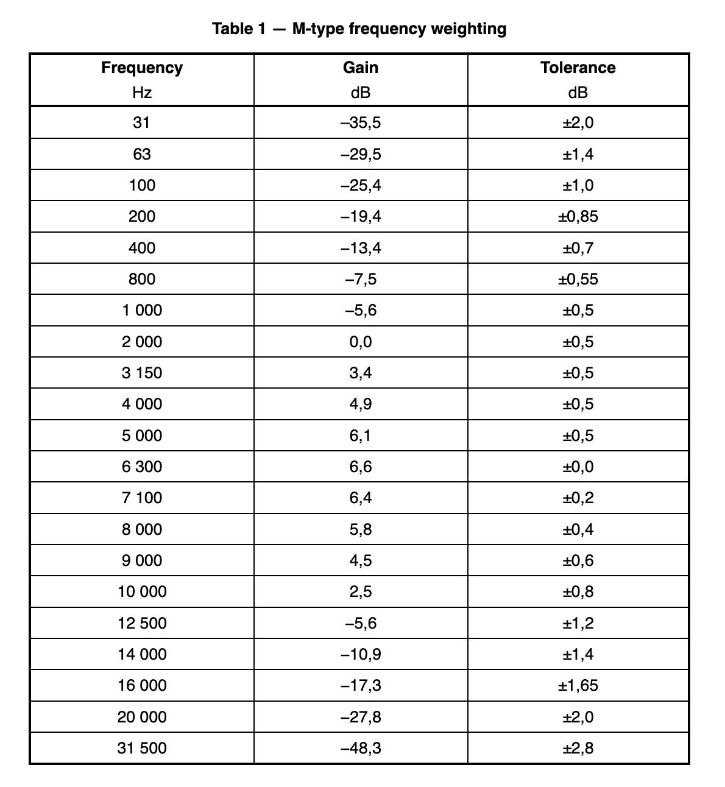

# ISO 21727:2016

* Title: **Cinematography — Method of measurement of perceived loudness of short duration motion-picture audio material**
* URL: [iso.org/standard/69744.html](https://www.iso.org/standard/69744.html)

## Abstract

ISO 21727:2016 specifies a method of measurement of short duration motion-picture sound that allows assessment of the subjective loudness and annoyance of the sound recording when replayed at the recommended replay level in rooms aligned with the characteristics of ISO 2969. The specified method of measurement assesses the entire duration of the sound recording, typically commercials and trailers that **do not exceed 3 minutes**, with suitable channel summation, frequency weighting and time integration. It does not specify a maximum recommended level for such material and is solely aimed at describing a **measurement method**.

NOTE: Typical recording and replay levels are discussed in Annex A.

## Extract

### Foreword

ISO (the International Organization for Standardization) is a worldwide federation of national standards bodies (ISO member bodies). The work of preparing International Standards is normally carried out through ISO technical committees. Each member body interested in a subject for which a technical committee has been established has the right to be represented on that committee. International organizations, governmental and non-governmental, in liaison with ISO, also take part in the work. ISO collaborates closely with the International Electrotechnical Commission (IEC) on all matters of electrotechnical standardization.
The procedures used to develop this document and those intended for its further maintenance are described in the ISO/IEC Directives, Part 1.  In particular the different approval criteria needed for the different types of ISO documents should be noted. This document was drafted in accordance with the editorial rules of the ISO/IEC Directives, Part 2 (see www.iso.org/directives).
Attention is drawn to the possibility that some of the elements of this document may be the subject of patent rights. ISO shall not be held responsible for identifying any or all such patent rights. Details of any patent rights identified during the development of the document will be in the Introduction and/or on the ISO list of patent declarations received (see www.iso.org/patents).
Any trade name used in this document is information given for the convenience of users and does not constitute an endorsement.
For an explanation on the meaning of ISO specific terms and expressions related to conformity assessment, as well as information about ISO's adherence to the WTO principles in the Technical Barriers to Trade (TBT) see the following URL: Foreword - Supplementary information
The committee responsible for this document is ISO/TC 36, Cinematography.
This second edition cancels and replaces the first edition (ISO 21727:2004), of which it constitutes a minor revision.

### Introduction

This International Standard is intended to be used in conjunction with the International Standards that cover the reproduction of motion-picture sound, A-chain and B-chain, including ISO 2969 and ISO 22234.
A recommended replay level architecture exists for most current cinema sound formats. This matches a specific recorded modulation level with a specific sound-pressure level at the main seating position in a room designed in accordance with ISO 2969 and ISO 22234. The noise and over-modulation points of each sound format are positioned to allow for a wide range of signal components to be recorded and faithfully reproduced at a valid absolute level as part of a motion-picture soundtrack.
Perhaps due to their competitive nature, many motion-picture commercials and trailers make sustained use of the highest recording level possible for the format. Consequently, many exhibitors now find the need to reduce the replay level to a point much lower than the recommendation. This has caused uncertainty as to the validity of the recommended replay level, which in turn creates problems in matching dubbing theatre sound to that expected from the average cinema.
This International Standard is intended to assist in assessing the subjective loudness of motion-picture sound so that a better match between the sound levels of commercials, trailers and main features is maintained, and so that confidence in the validity of the recommended replay level is re-established.

### 1. Scope

This International Standard specifies a method of measurement of short duration motion-picture sound that allows assessment of the subjective loudness and annoyance of the sound recording when replayed at the recommended replay level in rooms aligned with the characteristics of ISO 2969. The specified method of measurement assesses the entire duration of the sound recording, typically commercials and trailers that do not exceed 3 min in length, with suitable channel summation, frequency weighting and time integration. It does not specify a maximum recommended level for such material and is solely aimed at describing a measurement method.
NOTE Typical recording and replay levels are discussed in Annex A.

### 2. Normative references

The following documents, in whole or in part, are normatively referenced in this document and are indispensable for its application. For the dated reference, only the edition cited applies. For the undated reference, the latest edition of the referenced document (including any amendments) applies.
ISO 22234, Cinematography — Relative and absolute sound pressure levels for motion-picture multi-channel sound systems — Measurement methods and levels applicable to analog photographic film audio, digital photographic film audio and D-cinema audio

### 3. Terms and definitions

For the purposes of this document, the following terms and definitions apply.

#### 3.1 reference level

modulation level equivalent to 50 % modulation of optical variable-area soundtrack, −20 dB (level relative to digital full-scale) in the digital domain and 185 nW/m in the magnetic domain, measured using an average responding meter and a steady-state tone
Note 1 to entry: 100 % modulation of a single track of a two-track variable-area soundtrack has a dimensional modulation of 838,2 µm (0,033 in).

#### 3.2 reference pink noise

pink noise, band-limited to 20 Hz to 20 kHz, set at the reference level, using an average responding meter

#### 3.3 pink noise

stochastic signal having a continuous spectrum from at least 20 Hz to 20 kHz with equal energy ±0,5 dB per one-third octave of frequency and a Gaussian probability distribution of instantaneous amplitude

#### 3.4 recommended replay level

sound-pressure level (C-weighted with slow response) that the sound system should produce in the main seating area of the room with reference pink noise
Note 1 to entry: For example, a sound system set to a recommended replay level of 85 dB (C-frequency-weighted sound-pressure level relative to 20 µPa) will produce a sound-pressure level of 85 dB (C-weighted) in the main seating area of the room with reference pink noise.

#### 3.5 M-type frequency weighting

filter function as defined in Table 1

* Note 1 to entry: This filter function is based on a filter recommended by the International Telecommunications Union for the assessment of background noise in audio programmes.
* Note 2 to entry: This filter function has also been found to be useful for the purpose of assessing the human response to the loudness and annoyance of motion-picture soundtracks in calibrated rooms.

### 4 Method of measurement

#### 4.1 General

The measurement shall be carried out in the electrical domain in accordance with 4.2, which follows
the steps shown in Figure 1.
NOTE An acoustical method of measurement would be impractical and provide results of low accuracy and
low repeatability.
Figure 1 — Method of measurement

#### 4.2 Procedure

##### 4.2.1 Input calibration and M-type frequency weighting

Scale each input channel independently to normalize the reference level of the recording (recorded test
tone) to a level that represents that channel’s recommended replay level as provided by ISO 22234, and
then implement M-type frequency weighting.
NOTE 1 Absolute sound-pressure levels can be electrically represented by reference to a known level which
represents 20 µPa.
NOTE 2 A typical six-channel calibration is shown in Table 2.
Table 2 — Typical six-channel calibration

| Channel         | Sound-pressure level |
|-----------------|----------------------|
| Left            | 85 dB                |
| Centre          | 85 dB                |
| Right           | 85 dB                |
| Left surround   | 82 dB                |
| Right surround  | 82 dB                |
| Subwoofer (LFE) | 95 dB                |

> Sound-pressure level:  C-frequency-weighted sound-pressure level relative to
20 µPa.

##### 4.2.2 Scalar channel summation

Rectify and square the scaled M-type weighted signals of each audio channel, and then sum the
signals together.
NOTE This procedure ensures that the channel summation is scalar (ignoring phase) rather than vector. It
therefore simulates multi-sourced, broad-band, reverberant-field, acoustical summation.
